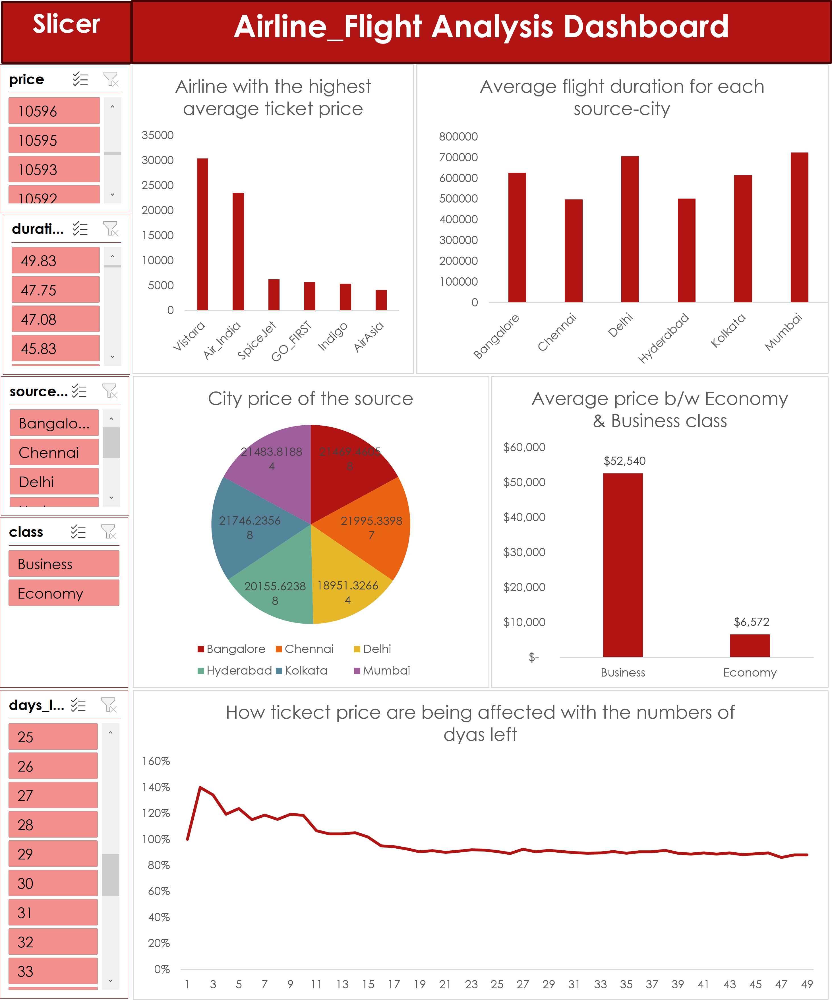
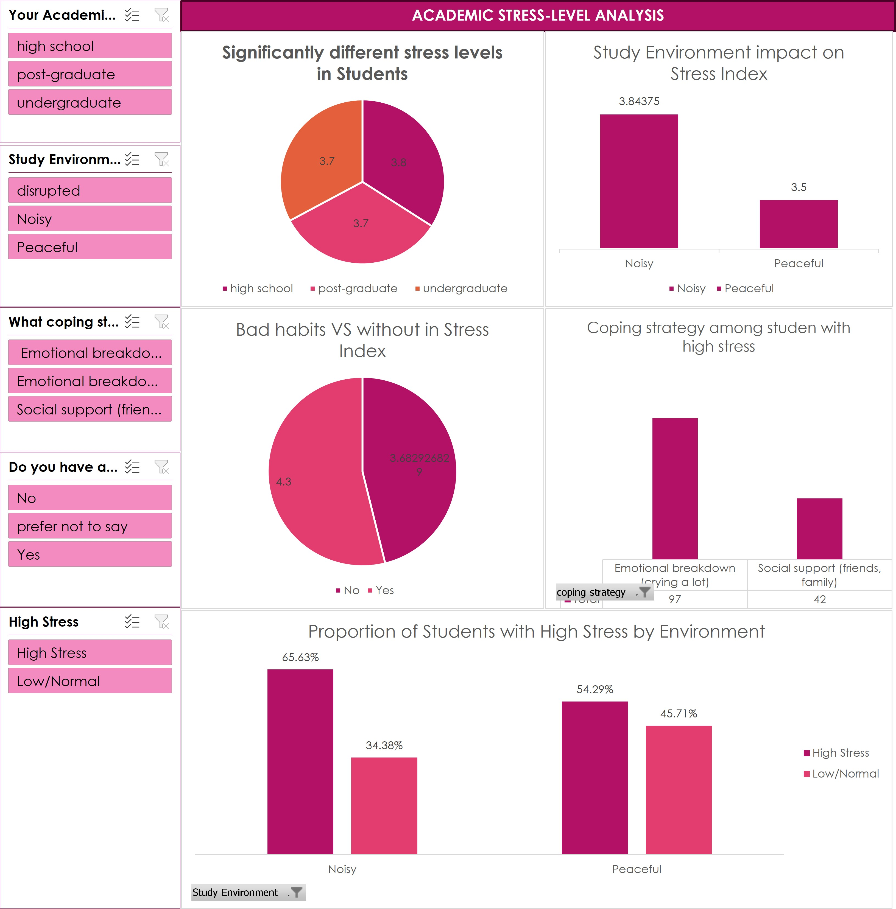

<!--Section 1: Introduce your self-->
## ABOUT ME

Hi! I'm Alfred Ibanga 🤓, a data analyst with a passion for turning data into actionable insights. I help businesses solve challenges and unlock growth.

<!--Mention your top/relevant skills here - core and soft skills-->
## SKILLS

**- ✅ Data Cleaning and Transformation.** 

**- ✅ Data Dashboard And Visualization.**

<!--Section 2: List 3-4 key projects-->
## MY PROJECTS 

*A glimpse of some of the projects I've been working on.*

[Read More](https://www.linkedin.com/posts/alfred-ibanga-44a29b2b3_my-first-analysis-in-excel-airline-flight-activity-7361419668596625409-s7Kr?utm_source=share&utm_medium=member_desktop&rcm=ACoAAEtTrboBFAI29OLxbSj3C_GuCmvhMgxsUPY)

**How I created a simple but clear dashboard with slicer to help Airline_Flight understand the patterns and behavours of their customers so as to make the right decisions.**

[Read More](https://www.linkedin.com/posts/alfred-ibanga-44a29b2b3_academic-stress-level-excel-dashboard-activity-7367203969846243328-4ehl?utm_source=share&utm_medium=member_desktop&rcm=ACoAAEtTrboBFAI29OLxbSj3C_GuCmvhMgxsUPY)

**How i help academics determine factors causing stress among students and how to manage it.**

 

## CONTACT DETAILS

*Let’s connect and see how we can make a difference together!*
<table>
  <tbody>
    <tr>
      <td>📧</td>
      <td><a href="mailto: alfredibanga377@gmail.com">alfredibanga377@gmail.com</a></td>
    </tr>
    <tr>
      <td>📞</td>
      <td>(234) 810-115-6708</td>

   

